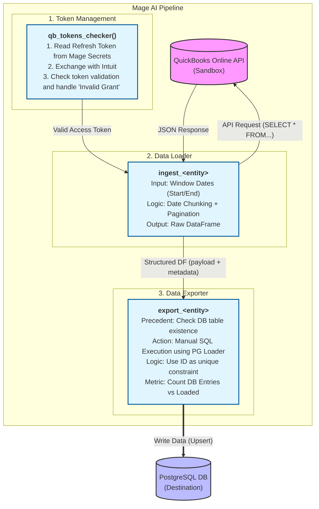
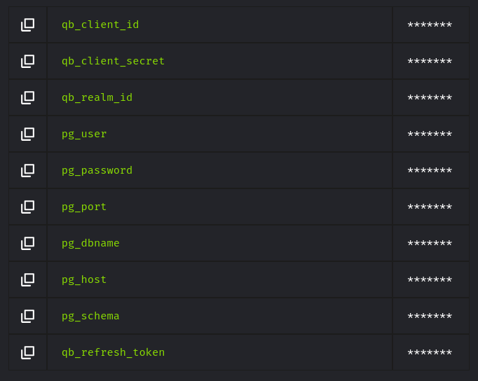
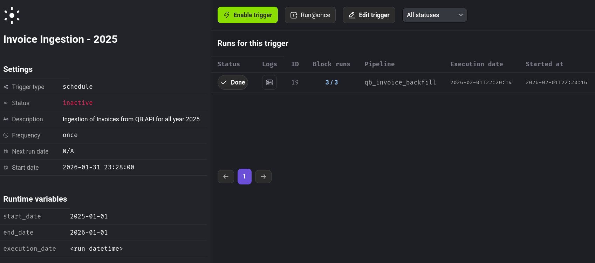

# Proyecto 1 de Data Mining 202520

**Mateo Vivanco (00328476)**

### Introducción
El siguiente trabajo tuvo como objetivo entender y utilizar herramientas de la industria para el carga, procesamiento y almacenamiento de información relevante respecto a un caso de negocios genérico. Con lo cual, se hizo uso de Docker, PostgreSQL y MageAI, junto con una API de uso público para conseguirlo.

### Descripción y diagrama de arquitectura
La estructura del proyecto se centró en utilizar el servicio sandbox de Quickbooks para extraer datos de prueba ficticios y procesarlos utilizando pipelines en MageAI, para finalmente almacenarlos en una base de datos Postgres. Los servicios de MageAI, de PostgreSQL y PGAdmin se encuentran en ejecución paralela e independiente como distintos contenedores Docker, utilizando Docker Compose. A continuación se detalla la arquitectura de las pipelines y como trabajan junto a la base de datos.



El pipeline inicialmente verifica la validez de los tokens guardados de MageAI para obtener el Access Token utilizando el Refresh Token. Una vez obtenido, el Data Loader lo lee y realiza las solicitudes API para la entidad especificada a Quickbooks, utilizando OAuth2. Toda la información de payload (JSON) se guarda junto a los metadatos pertinentes del tiempo de ingesta, y se estructura todo en un DataFrame de pandas. Finalmente, el Data Exporter se encarga de conectarse a la base de datos y verifica la existencia de la tabla especificada para cada entidad, caso contrario la crea. Y posteriormente envía toda el DF a ser insertado en la tabla, y en caso de que ya exista un elemento dentro de dicha tabla con un ID repetido, se actualiza para evitar duplicados.

**Componentes:**
- **MageAI**: orquestación de pipelines: `qb_<entidad>_backfill` para las entidades `Invoice`, `Item`, `Customer`.
- **PostgreSQL**: almacenamiento permanente de los datos en formato *raw* con idempotencia y unicidad para cada entidad, `qb_<entidad>`.
- **PGAdmin**: interfaz de monitoreo y consultas de la base de datos, para verificar formato y unicidad.
- **Docker Compose**: orquestación y configuración de contenedores para cada servicio.

### Pasos seguidos de configuración

**Levantamiento Inicial**
```bash
cd DataMining-PSet1
touch .env
nano .env
```
Es importante definir las variables de entorno faltantes en un archivo `.env` dentro del directorio principal para que funcione `docker compose`.

```yml
DB_USER=<USUARIO_PG>
DB_PASSWORD=<CONTRASEÑA_PG>
DB_PORT=<PUERTO_PG>
DB_NAME=<NOMBRE_PG>
PGADMIN_EMAIL=<EMAIL_PGADMIN>
PGADMIN_PASSWORD=<CONTRASEÑA_PGADMIN>
PGADMIN_PORT=<PUERTO_PGADMIN>
MAGEAI_PORT=<PUERTO_MAGE>
```
Utilizando los nombres especificados dentro del archivo `docker-compose.yaml` o en su defecto cambiarlos también en el archivo de configuración. Finalmente se puede ejecutar los contenedores.

```bash
docker compose build
docker compose up -d
```

**Acceso y ejecución**
Se verifica que los contenedores se inicializaron correctamente con `docker compose ps`. Finalmente se accede a la interfaz en línea de MageAI con el URL `http://<host_mage>:<puerto_mage>/` para utilizar el proyecto, siendo este de forma predeterminada `http://localhost:6789/`. Es necesario asegurarse de tener funcionando todos los Mage Secrets para el funcionamiento correcto de los pipelines.


### Gestión de secretos
Dentro de MageAI se manejan los datos sensibles como Mage Secrets:

| Secreto | Propósito | Rotación Esperada | Responsable |
|-|-|-|-|
| qb_client_id | Autenticación del usuario en OAuth2 | No puede ser rotado  | CTO |
| qb_client_secret | Autenticación del usuario en OAuth2 | Rotar instantáneamente en caso de exposición | CTO |
| qb_realm_id | ID único de la empresa | Rotar en caso de exposición | IT |
| qb_refresh_token | Token de permiso para la app. Usado para obtener un nuevo access token | Rotar 24 horas después de usarse o 90 días después de obtenerse | IT |
| pg_user | Autenticación del usuario en la base de datos | Rotar cada 12 meses | Administrador de la DB |
| pg_password | Autenticación del usuario en la base de datos | Rotar cada mes | Administrador de la DB |
| pg_dbname | Nombre de la base de datos para la conexión | Estático | Administrador de la DB |
| pg_host | Host/IP del servidor ejecutando la base de datos | Estático | Infraestructura |
| pg_port | Puerto donde se ejecuta la base de datos dentor del host | Mantener el valor predeterminado a menos que sea estrictamente necesario | Infraestructura |
| pg_schema | Nombre del esquema donde está la tabla en la que guardar los datos| Estático (public por default) | Director de la DB |




### Detalles de los triggers
Se configuraron Triggers One-time para cada uno de los pipelines. Para los casos de `qb_customer_backfill` y `qb_item_backfill` los triggers simplemente ejecutan el pipeline completo, registraron los logs para cada paso en cada uno de los bloques. Sin embargo, para el caso de `qb_invoice_backfill` se configuraron varios triggers de ejecución única, cada uno con un rango de fechas específico distinto (en formato `yyyy-mm-dd`, UTC), de tal forma que cada uno permita obtener un registro para diferentes situaciones. Para este último, se obtuvo todos los objetos Invoice cuya transacción haya ocurrido en 2025.



Además, los triggers se utilizaron para registrar en los logs información relevante de posibles errores o métricas del número de objetos extraídos vs exportados.

Es importante mencionar que todas las fechas se encuentran en formato UTC, el cual difiere en 5 horas con la zona horaria de Ecuador/Guayaquil = UTC-5, tal que (en formato ISO):

| UTC | Guayaquil |
|-|-|
| 2025-12-31T12:00:00+00:00 | 2025-12-31T07:00:00-05:00 |
| 2025-12-01T00:00:00+00:00 | 2025-11-30T07:19:00-05:00 |

### Esquema *raw* en Postgres
Para cada entidad, se creó una tabla con el nombre `qb_<entidad>`, todas con los siguientes atributos y tipos:

| Atributo | Tipo | Descripción |
|-|-|-|
| **id** | INT PK | Identificador único desde QuickBooks |
| payload | JSONB | JSON completo para trazabilidad total |
| ingested_at_utc | TIMESTAMPTZ | Timestamp único del momento de la ingesta en UTC |
| extract_window_start_utc | TIMESTAMPTZ | Inicio de la ventana de extracción en UTC|
| extract_window_end_utc | TIMESTAMPTZ | Fin de la ventana de extracción en UTC|
| page_number | INT | Número de página dentro de un chunk |
| page_size | INT | Tamaño de chunk solicitado |
| request_payload | TEXT | Query SQL-like enviada hacia la API |

Todos los atributos anteriores se configuraron como NO NULOS para controlar la ingesta de datos en caso de que se encuentren incompletos o sean de tipo erróneo.

### Detalles de uso

**Descripción del backfill**

Lo primero que se debió hacer fue configurar los secretos dentro de Mage para evitar exponer información importante acerca del proyecto. Para ello se tuvo que extraer varias credenciales de OAuth2 Playground para poder utilizar la API de Quickbooks para una empresa sandbox, y posteriormente guardarlos como secretos, para que puedan ser utilizaros dentro de los pipelines. Luego se obtuvo toda la información importante respecto a la autenticación de la base de datos PostgreSQL y se los puso como variables de entorno secretas, sin ser expuestas dentro del código ni dentro de los archivos de configuración. Luego se definieron los pipelines y sus triggers. 

Los 3 pipelines ejecutan esencialmente los mismos pasos:
1. Se verifica que el `qb_refresh_token` siga vigente y se obtiene el `access_token` para comuncarse con la API de Quickbooks.
2. Se verifican las variables de ejecución (en caso de que existan dentro del pipeline) y se obtiene los mage secrets. Posteriormente, se realiza la consulta SQL-like mediante un request HTTP y se registran los metadatos estipulados en la estructura anterior de la tabla. Todo se ordena en un DataFrame.
3. Se verifica la conexión a PostgreSQL y que la tabla a la que se va a exportar exista. Se exporta los datos a la tabla teniendo en cuenta la unicidad de los ID para evitar duplicados. Así mismo, la base de datos se encarga de verificar que los tipos de los datos sean correctos, y sean no nulos.

Para cada uno de los pipelines se especificó un tamaño de página de 100 objetos para evitar sobrecarga de procesamiento, y un backoff exponencial de $2^n$ segundos para $n$ intentos fallidos, para un máximo de 5 intentos fallidos antes de detener completamente la ejecución. Adicionalmente, para `Invoice`, se especificó un rango de 7 días de tamaño de chunk para segmentar los datos por semanas del año.

**Runbook**

1. Verificar la validez del `qb_refresh_token`.
2. Ejecutar un pipeline una vez por intento (para evitar problemas de concurrencia o bloqueos a la API o DB) mediante los triggers configurados.
3. Verificar la información de los logs dentro del trigger para información de las métricas y posibles errores.
4. Validar la información en PostgreSQL mediante PGAdmin o mediante un query (idempotencia, formato, etc.).
5. Verificar volumetría mediante logs o PGAdmin.
6. En caso de existir algún incoveniente encontrado en las verificaciones anteriores, reejecutar el trigger desde el principio (recomendado) o en su defecto reaundar desde el último bloque exitoso (no recomendado).

**Post-ejecución**
1. Validar métricas, integridad datos e idempotencia.
2. Deshabilitar triggers para evitar relanzamientos.
3. Documentar y comparar métricas.
4. Asegurar persistencia de los datos de los contenedores y detener su ejecución de forma controlada para evitar pérdidas.


### Troubleshooting General

| Problema | Descripción | Solución |
|-|-|-|
| HTTP 401 | Invalid Grant en autenticación API | Rotar el `qb_refresh_token`. Importante mencionar que caduca 24 horas después de usarse |
| Existencia de duplicados | La idempotencia no funciona correctamente en la DB | Configurar correctamente el `unique_constraints` dentro del loader de MageAI |
| Extracción de Invoice incompleta | El conteo final de Invoice en la DB no cuadraba con el total extraído | Corregir el formato del rango de fechas dentro del query |
| HTTP 400 | Bad Request para Invoice a la API | Eliminar la parte del tiempo de la fecha en formato ISO |
| Conexión fallida a la DB | MageAI loader fallaba al conectar con la DB | Corregir el nombre del servicio docker dentro del nombre del host |

## Checklist de aceptación
- [x] Mage y Postgres se comunican por nombre de servicio.
- [x] Todos los secretos (QBO y Postgres) están en Mage Secrets; no hay secretos en el repo/entorno expuesto.
- [x] Pipelines qb_invoice_backfill acepta fecha_inicio y fecha_fin (UTC) y segmenta el rango.
- [x] Trigger one-time configurado, ejecutado y luego deshabilitado/marcado como completado.
- [x] Esquema raw con tablas por entidad, payload completo y metadatos obligatorios.
- [x] Idempotencia verificada: reejecución de un tramo no genera duplicados.
- [x] Paginación y rate limits manejados y documentados.
- [x] Volumetría y validaciones mínimas registradas y archivadas como evidencia.
- [x] Runbook de reanudación y reintentos disponible y seguido.