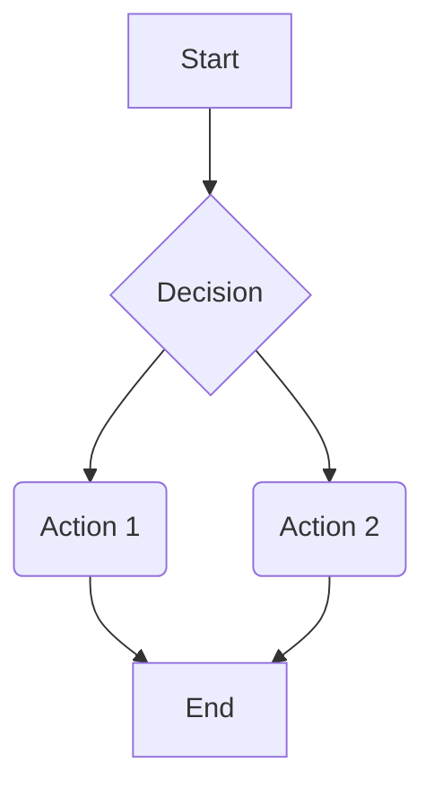

# Proyecto 1 de Data Mining 202520

**Mateo Vivanco (00328476)**

### Introducción
El siguiente trabajo tuvo como objetivo entender y utilizar herramientas de la industria para el carga, procesamiento y almacenamiento de información relevante respecto a un caso de negocios genérico. Con lo cual, se hizo uso de Docker, Postgres y MageAI, junto con una API de uso público para conseguirlo.

### Descripción y diagrama

### Pasos seguidos de configuración

### Gestión de secretos

### Detalles de los triggers

### Esquema *raw* en Postgres
Para cada entidad, se creó una tabla con el nombre `qb_<entidad>`, todas con los siguientes atributos y tipos:

| Atributo | Tipo | Descripción |
|----------|------|----------------|
| **id** | INT PK | Identificador único desde QuickBooks |
| payload | JSONB | JSON completo para trazabilidad total |
| ingested_at_utc | TIMESTAMPTZ | Timestamp único del momento de la ingesta en UTC |
| extract_window_start_utc | TIMESTAMPTZ | Inicio de la ventana de extracción en UTC|
| extract_window_end_utc | TIMESTAMPTZ | Fin de la ventana de extracción en UTC|
| page_number | INT | Número de página dentro de un chunk |
| page_size | INT | Tamaño de chunk solicitado |
| request_payload | TEXT | Query SQL-like enviada hacia la API |

### Detalles de uso

### Troubleshooting General

## Checklist de aceptación
- [x] Mage y Postgres se comunican por nombre de servicio.
- [x] Todos los secretos (QBO y Postgres) están en Mage Secrets; no hay secretos en el repo/entorno expuesto.
- [x] Pipelines qb_<entidad>_backfill acepta fecha_inicio y fecha_fin (UTC) y segmenta el rango.
- [x] Trigger one-time configurado, ejecutado y luego deshabilitado/marcado como completado.
- [x] Esquema raw con tablas por entidad, payload completo y metadatos obligatorios.
- [x] Idempotencia verificada: reejecución de un tramo no genera duplicados.
- [x] Paginación y rate limits manejados y documentados.
- [x] Volumetría y validaciones mínimas registradas y archivadas como evidencia.
- [x] Runbook de reanudación y reintentos disponible y seguido.